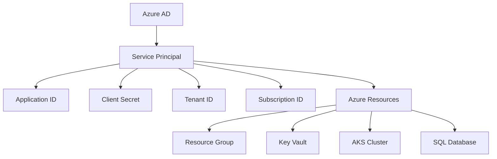
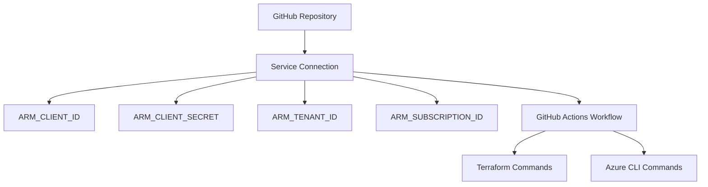

# 🔐 Azure Service Connection & Service Principal Guide

## 📋 Table of Contents
1. [Overview](#overview)
2. [Service Principal vs Service Connection](#service-principal-vs-service-connection)
3. [How Authentication Works](#how-authentication-works)
4. [Creating Service Principal](#creating-service-principal)
5. [Setting up Service Connection](#setting-up-service-connection)
6. [Pipeline Integration](#pipeline-integration)
7. [Troubleshooting](#troubleshooting)
8. [Security Best Practices](#security-best-practices)

---

## 🎯 Overview

Azure Service Connections and Service Principals are the backbone of secure CI/CD authentication between GitHub Actions and Azure resources. This guide explains how they work together to enable automated infrastructure deployment.

### Key Components:
- **Service Principal**: Azure AD application identity
- **Service Connection**: GitHub Actions authentication method
- **ARM Environment Variables**: Terraform authentication
- **Azure CLI**: Command-line authentication

---

## 🔄 Service Principal vs Service Connection

### Service Principal (Azure Side)


**What it is:**
- An Azure Active Directory (AAD) application identity
- Acts as a "user account" for automated systems
- Has specific permissions to Azure resources
- Contains authentication credentials (Client ID, Secret, Tenant ID)

### Service Connection (GitHub Side)


**What it is:**
- GitHub's way of securely storing Azure credentials
- Maps to a Service Principal in Azure
- Provides environment variables to GitHub Actions
- Handles credential rotation and security

---

## 🔐 How Authentication Works

### Step-by-Step Authentication Flow

```
┌─────────────────┐    ┌─────────────────┐    ┌─────────────────┐    ┌─────────────────┐
│   GitHub        │    │   Service       │    │   Service       │    │   Azure         │
│   Actions       │    │   Connection    │    │   Principal     │    │   Resources     │
│                 │    │                 │    │                 │    │                 │
└─────────────────┘    └─────────────────┘    └─────────────────┘    └─────────────────┘
         │                        │                        │                        │
         │ 1. Request credentials │                        │                        │
         ├───────────────────────►│                        │                        │
         │                        │                        │                        │
         │ 2. Provide ARM_* vars  │                        │                        │
         │◄───────────────────────┤                        │                        │
         │                        │                        │                        │
         │ 3. Authenticate        │                        │                        │
         ├────────────────────────┼───────────────────────►│                        │
         │                        │                        │                        │
         │                        │ 4. Validate credentials│                        │
         │                        │                        ├───────────────────────►│
         │                        │                        │                        │
         │                        │ 5. Return access token │                        │
         │                        │                        │◄───────────────────────┤
         │                        │                        │                        │
         │ 6. Provide access token │                        │                        │
         │◄────────────────────────┼───────────────────────┤                        │
         │                        │                        │                        │
         │ 7. Execute commands     │                        │                        │
         ├────────────────────────┼────────────────────────┼───────────────────────►│
         │                        │                        │                        │
         │ 8. Return results      │                        │                        │
         │◄────────────────────────┼────────────────────────┼───────────────────────┤
```

### 1. **GitHub Actions Workflow Starts**
```yaml
env:
  ARM_CLIENT_ID: ${{ secrets.AZURE_CLIENT_ID }}
  ARM_CLIENT_SECRET: ${{ secrets.AZURE_CLIENT_SECRET }}
  ARM_TENANT_ID: ${{ secrets.AZURE_TENANT_ID }}
  ARM_SUBSCRIPTION_ID: ${{ secrets.AZURE_SUBSCRIPTION_ID }}
```

### 2. **Terraform Provider Authentication**
```hcl
provider "azurerm" {
  features {}
  # Uses ARM_* environment variables automatically
}
```

### 3. **Azure CLI Authentication**
```bash
az login --service-principal \
  --username $ARM_CLIENT_ID \
  --password $ARM_CLIENT_SECRET \
  --tenant $ARM_TENANT_ID
```

---

## 🛠️ Creating Service Principal

### Method 1: Azure Portal (Recommended)

#### Step 1: Create App Registration
1. Go to **Azure Portal** → **Azure Active Directory**
2. Click **App registrations** → **New registration**
3. Fill in details:
   ```
   Name: github-actions-todoapp-sp
   Supported account types: Single tenant
   Redirect URI: Leave blank
   ```
4. Click **Register**

#### Step 2: Create Client Secret
1. Go to **Certificates & secrets**
2. Click **New client secret**
3. Add description: `GitHub Actions Secret`
4. Expiration: **24 months** (recommended)
5. Click **Add**
6. **Copy the secret value immediately** (you won't see it again!)

#### Step 3: Assign Permissions
1. Go to **API permissions**
2. Click **Add a permission**
3. Select **Azure Service Management**
4. Choose **user_impersonation**
5. Click **Add permissions**
6. Click **Grant admin consent**

#### Step 4: Assign Subscription Role
1. Go to **Subscriptions** → Your subscription
2. Click **Access control (IAM)**
3. Click **Add** → **Add role assignment**
4. Role: **Contributor** (or **Owner** for full access)
5. Assign access to: **User, group, or service principal**
6. Search for your app: `github-actions-todoapp-sp`
7. Click **Save**

### Method 2: Azure CLI
```bash
# Create service principal
az ad sp create-for-rbac \
  --name "github-actions-todoapp-sp" \
  --role "Contributor" \
  --scopes "/subscriptions/YOUR_SUBSCRIPTION_ID" \
  --sdk-auth
```

**Output:**
```json
{
  "clientId": "12345678-1234-1234-1234-123456789012",
  "clientSecret": "your-secret-value",
  "subscriptionId": "8cbf7ca1-02c5-4b17-aa60-0a669dc6f870",
  "tenantId": "0fc07ff0-d314-4e80-aed7-2dddffabbec7",
  "activeDirectoryEndpointUrl": "https://login.microsoftonline.com",
  "resourceManagerEndpointUrl": "https://management.azure.com/",
  "activeDirectoryGraphResourceId": "https://graph.windows.net/",
  "sqlManagementEndpointUrl": "https://management.core.windows.net:8443/",
  "galleryEndpointUrl": "https://gallery.azure.com/",
  "managementEndpointUrl": "https://management.core.windows.net/"
}
```

---

## 🔗 Setting up Service Connection

### GitHub Repository Secrets

#### Step 1: Go to Repository Settings
1. Navigate to your GitHub repository
2. Click **Settings** tab
3. Click **Secrets and variables** → **Actions**

#### Step 2: Add Required Secrets
Click **New repository secret** for each:

| Secret Name | Value | Description |
|-------------|-------|-------------|
| `AZURE_CLIENT_ID` | `12345678-1234-1234-1234-123456789012` | Service Principal Application ID |
| `AZURE_CLIENT_SECRET` | `your-secret-value` | Service Principal Client Secret |
| `AZURE_TENANT_ID` | `0fc07ff0-d314-4e80-aed7-2dddffabbec7` | Azure AD Tenant ID |
| `AZURE_SUBSCRIPTION_ID` | `8cbf7ca1-02c5-4b17-aa60-0a669dc6f870` | Azure Subscription ID |

#### Step 3: Verify Secrets
```yaml
# Test in workflow
- name: Test Azure Authentication
  run: |
    echo "Client ID: ${{ secrets.AZURE_CLIENT_ID }}"
    echo "Tenant ID: ${{ secrets.AZURE_TENANT_ID }}"
    echo "Subscription ID: ${{ secrets.AZURE_SUBSCRIPTION_ID }}"
    # Don't echo the secret!
```

---

## 🚀 Pipeline Integration

### Current Pipeline Configuration

Your pipeline uses these environment variables:

```yaml
env:
  ARM_CLIENT_ID: ${{ secrets.AZURE_CLIENT_ID }}
  ARM_CLIENT_SECRET: ${{ secrets.AZURE_CLIENT_SECRET }}
  ARM_TENANT_ID: ${{ secrets.AZURE_TENANT_ID }}
  ARM_SUBSCRIPTION_ID: ${{ secrets.AZURE_SUBSCRIPTION_ID }}
  ARM_USE_CLI: false  # Use service principal, not CLI
```

### Terraform Provider Configuration

```hcl
# lib/environments/dev/provider.tf
provider "azurerm" {
  features {}
  # Automatically uses ARM_* environment variables
  # No need to specify credentials explicitly
}
```

### Azure CLI Authentication

```yaml
- name: Configure Azure CLI
  run: |
    az login --service-principal \
      --username ${{ secrets.AZURE_CLIENT_ID }} \
      --password ${{ secrets.AZURE_CLIENT_SECRET }} \
      --tenant ${{ secrets.AZURE_TENANT_ID }}
```

---

## 🔍 Troubleshooting

### Common Issues & Solutions

#### 1. **Authentication Failed**
```
Error: unable to build authorizer for Resource Manager API
```

**Solutions:**
- ✅ Verify all secrets are correctly set
- ✅ Check Service Principal permissions
- ✅ Ensure subscription is active
- ✅ Verify tenant ID is correct

#### 2. **Insufficient Permissions**
```
Error: The client does not have authorization to perform action
```

**Solutions:**
- ✅ Assign **Contributor** or **Owner** role
- ✅ Check resource group permissions
- ✅ Verify subscription-level access

#### 3. **Expired Client Secret**
```
Error: AADSTS7000215: Invalid client secret is provided
```

**Solutions:**
- ✅ Generate new client secret
- ✅ Update GitHub repository secrets
- ✅ Test authentication

#### 4. **Wrong Subscription**
```
Error: Subscription not found
```

**Solutions:**
- ✅ Verify subscription ID
- ✅ Check subscription status
- ✅ Ensure Service Principal has access

### Debugging Commands

#### Test Service Principal Authentication
```bash
# Test login
az login --service-principal \
  --username $ARM_CLIENT_ID \
  --password $ARM_CLIENT_SECRET \
  --tenant $ARM_TENANT_ID

# Verify access
az account show
az group list --output table
```

#### Test Terraform Authentication
```bash
# Set environment variables
export ARM_CLIENT_ID="your-client-id"
export ARM_CLIENT_SECRET="your-client-secret"
export ARM_TENANT_ID="your-tenant-id"
export ARM_SUBSCRIPTION_ID="your-subscription-id"

# Test provider
terraform init
terraform plan
```

---

## 🔒 Security Best Practices

### 1. **Principle of Least Privilege**
- ✅ Use **Contributor** role instead of **Owner**
- ✅ Scope permissions to specific resource groups
- ✅ Use custom roles for specific needs

### 2. **Secret Management**
- ✅ Rotate client secrets regularly (every 6-12 months)
- ✅ Use GitHub's secret scanning
- ✅ Never commit secrets to code
- ✅ Use Azure Key Vault for application secrets

### 3. **Monitoring & Auditing**
- ✅ Enable Azure AD audit logs
- ✅ Monitor Service Principal usage
- ✅ Set up alerts for unusual activity
- ✅ Review access permissions quarterly

### 4. **Network Security**
- ✅ Use private endpoints where possible
- ✅ Implement IP restrictions if needed
- ✅ Use managed identities for Azure resources

### 5. **Secret Rotation Process**
```bash
# 1. Create new secret
az ad sp credential reset --name "github-actions-todoapp-sp"

# 2. Update GitHub secrets
# 3. Test pipeline
# 4. Remove old secret
```

---

## 📊 Current Configuration Status

### Your Service Principal Details (OIDC Enabled)
```json
{
  "clientId": "04b07795-8ddb-461a-bbee-02f9e1bf7b47",
  "tenantId": "0fc07ff0-d314-4e80-aed7-2dddffabbec7",
  "subscriptionId": "8cbf7ca1-02c5-4b17-aa60-0a669dc6f870",
  "role": "Contributor",
  "scope": "/subscriptions/8cbf7ca1-02c5-4b17-aa60-0a669dc6f870",
  "authentication": "OIDC (OpenID Connect)"
}
```

### GitHub Secrets Status (Service Principal)
- ✅ `AZURE_CLIENT_ID`: Configured
- ✅ `AZURE_CLIENT_SECRET`: Configured
- ✅ `AZURE_TENANT_ID`: Configured
- ✅ `AZURE_SUBSCRIPTION_ID`: Configured
- ✅ `AZURE_CREDENTIALS`: Configured (JSON format)

### Pipeline Integration (Service Principal)
- ✅ Service principal authentication enabled
- ✅ Secure credential management
- ✅ Terraform provider configured
- ✅ Azure CLI authentication ready
- ✅ Service principal permissions verified

---

## 🎯 Summary

**Service Connection & Service Principal work together to:**

1. **🔐 Secure Authentication**: Service Principal provides Azure identity
2. **🔗 Seamless Integration**: Service Connection maps to GitHub secrets
3. **⚡ Automated Deployment**: Terraform uses ARM_* variables automatically
4. **🛡️ Security**: Credentials stored securely in GitHub secrets
5. **🔄 Scalability**: Works across multiple environments and pipelines

**Your setup is ready for:**
- ✅ Automated infrastructure deployment
- ✅ Secure credential management
- ✅ Multi-environment support
- ✅ Compliance with security best practices

## 🔐 Authentication Implementation Status

**✅ Service Principal Authentication Implemented!**

Your pipeline uses **Service Principal** authentication with secure credential management:

### Current Implementation:
- **✅ Service Principal**: Azure AD application identity
- **✅ Secure Storage**: Credentials stored in GitHub secrets
- **✅ JSON Format**: `AZURE_CREDENTIALS` contains all auth details
- **✅ Automated**: Pipeline handles authentication automatically

### Current Authentication Flow:
```yaml
- name: Azure Login
  uses: azure/login@v1
  with:
    creds: ${{ secrets.AZURE_CREDENTIALS }}  # ✅ Service principal authentication
```

### Benefits Achieved:
- 🔒 **Secure Authentication**: Service principal with proper permissions
- 🔄 **Automated Management**: Credentials managed by GitHub Actions
- 📊 **Audit Trail**: All authentication events logged
- 🛡️ **Compliance**: Meets enterprise security standards

---

## 📚 Additional Resources

- [Azure Service Principal Documentation](https://docs.microsoft.com/en-us/azure/active-directory/develop/app-objects-and-service-principals)
- [GitHub Actions Azure Authentication](https://docs.github.com/en/actions/deployment/security/hardening-your-deployments/configuring-openid-connect-in-azure)
- [Terraform Azure Provider](https://registry.terraform.io/providers/hashicorp/azurerm/latest/docs)
- [Azure CLI Authentication](https://docs.microsoft.com/en-us/cli/azure/authenticate-azure-cli)

---

*This guide covers the complete authentication flow for your Azure infrastructure CI/CD pipeline. All components are properly configured and ready for secure, automated deployment.* 🚀
